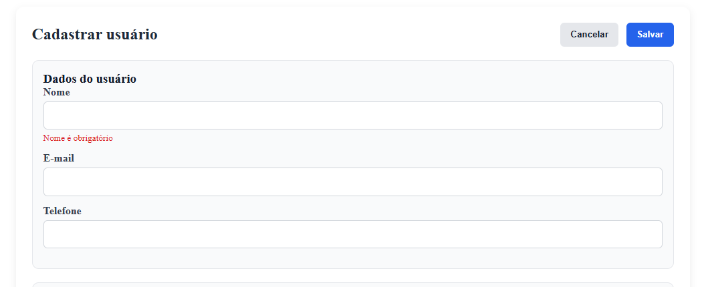
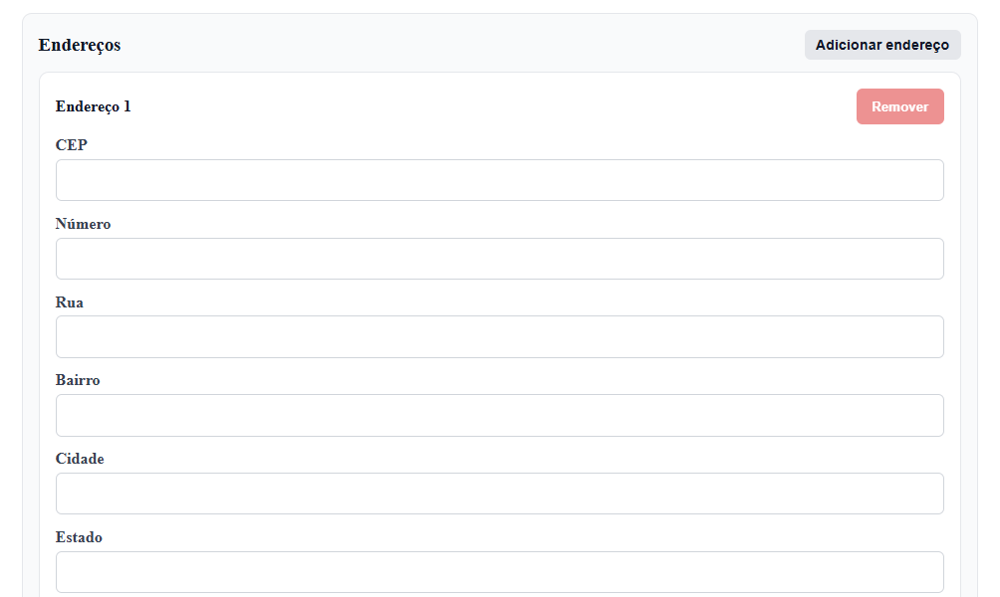
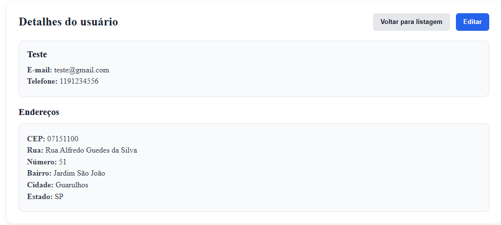
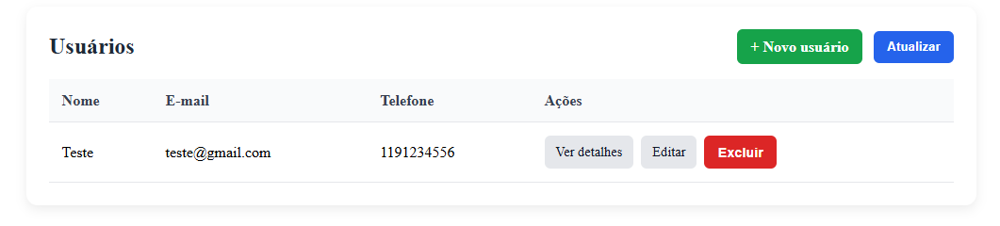

# Desafio Técnico — CRUD de Usuários e Endereços

Aplicação Fullstack para gerenciamento de usuários e seus endereços, com validação de CEP via integração com a API pública ViaCEP.

## Descrição do Projeto

A aplicação permite realizar o CRUD completo de usuários, onde cada usuário pode ter um ou mais endereços associados. Durante o cadastro ou edição, o CEP informado é validado em tempo real contra a API do ViaCEP, preenchendo automaticamente os campos de rua, bairro, cidade e estado — impedindo o cadastro caso o CEP seja inválido.

### Funcionalidades

- Listagem de usuários
- Cadastro de usuário com um ou mais endereços
- Visualização de detalhes do usuário com endereços vinculados
- Edição de usuário e endereços
- Exclusão de usuário (com exclusão em cascata dos endereços)
- Validação de CEP em tempo real (ao sair do campo) e no momento de salvar
- Feedback visual: spinner global durante chamadas à API e toasts de sucesso/erro

## Tecnologias Utilizadas

### Backend
- Java 17
- Spring Boot 3.5.16
- Spring Data JPA
- Spring Web
- Bean Validation
- H2 Database (ambiente de desenvolvimento)
- PostgreSQL (ambiente de produção)
- JUnit 5 + Mockito (testes unitários)
- Maven

### Frontend
- Angular 22 (standalone components, signals)
- TypeScript
- Reactive Forms
- RxJS

## Estrutura do Projeto

```
desafio-tecnico-fullstack/
├── backend/          # API REST em Spring Boot
└── frontend/         # Aplicação Angular
```

## Como Rodar o Backend

### Pré-requisitos
- Java 17 (JDK)
- Maven (ou use o `mvnw` incluso no projeto)

### Ambiente de desenvolvimento (H2 — padrão)

O profile `dev` já vem ativado por padrão. Basta rodar:

```bash
cd backend
./mvnw spring-boot:run
```

No Windows (PowerShell):

```powershell
cd backend
.\mvnw spring-boot:run
```

A aplicação sobe em `http://localhost:8080`, usando um banco H2 em memória (os dados são resetados a cada reinício).

O console do H2 fica disponível em `http://localhost:8080/h2-console`:
- **JDBC URL:** `jdbc:h2:mem:desafiodb`
- **Usuário:** `sa`
- **Senha:** (em branco)

### Ambiente de produção (PostgreSQL)

1. Crie um banco PostgreSQL local (ou use um já existente) chamado `desafiodb`.
2. Configure as variáveis de ambiente (ou ajuste diretamente em `application-prod.properties`):

```bash
DB_USER=seu_usuario
DB_PASSWORD=sua_senha
```

3. Rode a aplicação apontando para o profile `prod`:

```bash
./mvnw spring-boot:run -Dspring-boot.run.profiles=prod
```

## Como Rodar o Frontend

### Pré-requisitos
- Node.js (versão LTS)
- Angular CLI (`npm install -g @angular/cli`)

### Passos

```bash
cd frontend
npm install
ng serve
```

A aplicação sobe em `http://localhost:4200`.

> **Importante:** o backend precisa estar rodando simultaneamente (porta 8080) para que o frontend consiga se comunicar com a API.

## Como Rodar os Testes

### Backend

```bash
cd backend
./mvnw test
```

Os testes cobrem:
- Repositórios (`UserRepository`, `AddressRepository`) com `@DataJpaTest`
- Validação de CEP (`CepValidationService`) com testes unitários mockando a API ViaCEP
- Lógica de negócio do CRUD (`UserService`), cobrindo criação, atualização (incluindo substituição de endereços), exclusão e tratamento de erros

## Endpoints da API

| Método | Endpoint | Descrição |
|--------|----------|-----------|
| GET | `/api/users` | Lista todos os usuários |
| GET | `/api/users/{id}` | Busca usuário por ID (com endereços) |
| POST | `/api/users` | Cria usuário + endereço(s) |
| PUT | `/api/users/{id}` | Atualiza usuário + endereço(s) |
| DELETE | `/api/users/{id}` | Remove usuário e endereços vinculados |
| GET | `/api/cep/{cep}` | Consulta um CEP isoladamente (usado pelo frontend para preenchimento automático em tempo real) |

## Decisões de Design

- **Endereço não possui CRUD próprio separado**: como a especificação define que o endereço é sempre parte do usuário ("cada usuário terá um ou mais endereços associados"), o cadastro e edição de endereços foi implementado como uma lista dinâmica (`FormArray`) dentro do próprio formulário de usuário, tanto no backend (endereços processados dentro do fluxo de criação/atualização de usuário) quanto no frontend.
- **Validação de CEP em duas camadas**: o frontend valida o CEP assim que o usuário sai do campo (endpoint `/api/cep/{cep}`), dando feedback imediato. O backend valida novamente no momento de salvar, garantindo a integridade dos dados independentemente da origem da requisição.
- **Sistema de toasts próprio**: optou-se por implementar um sistema de notificações simples ao invés de uma biblioteca externa (como `ngx-toastr`), devido a um conflito de compatibilidade de versão entre a biblioteca e o Angular 22 usado no projeto.









